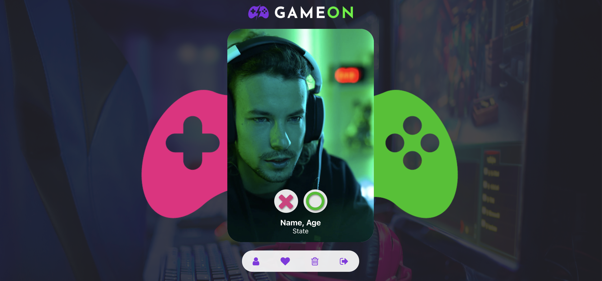

# 🎮  GAME ON

initially was a dating web application where gamers could meet and fall in love for each other based on their favorite console and game but after a deeper research re realized that most gamers don't really go out to pubs and restaurants on dates, do instead of making it straight to the relationship this application was build so gamers could meet other games from different parts of the world, build a friendship playing games together and maybe let them to fell in love after playing for some time together.
this project is was divided in 3 sections Users, Friend-list, and private chat

#### Users

- Users can sign up and sign in
- Users can Edit their account (and add extra information and a profile picture)
- Users can delete their account

features not yet fully functioning

#### Friend-list

- Users can invite other users to be their friend
- The receiver has the option to decline or accept the invite
- Users have the option to cancel a invitation they made

#### Private Chat
- Users can Chat privately with users they are friends with on a live chat basis

*the styling of the users card will be displayed as a tinder-like carousel where users will initially only see the users that match with their fav console, and they will have an option to change to other consoles on a filter, because most gamers have multiple consoles.

live project : https://date-a-gamer.herokuapp.com/

